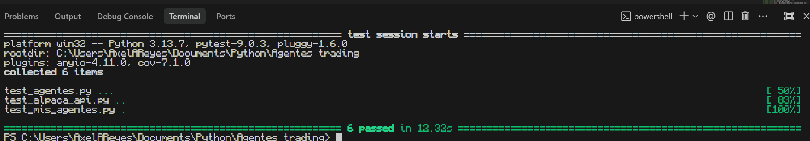

# DeepAxo - Algorithmic Trading Terminal

**DeepAxo** is a production-grade desktop platform designed for automated financial analysis and algorithmic trade execution. 

*(Note: This repository serves as a technical showcase highlighting software architecture and quality assurance practices. The source code regarding the trading agents, predictive models, and risk management logic is maintained in a private repository to protect intellectual property).*

## System Architecture

The software was developed using a strict modular architecture, decoupling the presentation layer from the core data processing engine:
* **Frontend:** Built with PySide6 (Qt for Python). It features a premium responsive design, a bespoke Dark Mode (#1A1A1A) with mechanical UI animations, and interactive financial charting rendered via Matplotlib.
* **Analysis Engine:** A multi-agent system written in Python that automates market tracking and forecasts trends using Machine Learning classification models (`RandomForestClassifier`).
* **Persistence & Connectivity:** Relies on a normalized PostgreSQL database for real-time transactional logging and executes market orders seamlessly through the Alpaca API.

## Quality Assurance (QA) & Testing Strategy

Developed with a strong emphasis on **Quality Assurance** and **ISTQB** principles, the platform prioritizes system stability, auditability, and proactive defect prevention:

* **Automated Functional Testing:** A comprehensive structural test suite was implemented using `PyTest` and `unittest.mock` to isolate and deterministically validate:
  * The pinpoint accuracy of technical indicators (RSI, SMA) while filtering out false positives.
  * The strict enforcement of risk management logic (automatically blocking trades that exceed predefined leverage thresholds).
  * The safe handling of empty data structures during simulated database outages.
* **Fault Tolerance & Resilience:** The dashboard is fortified with visual and logical safeguards that detect API latency or network drops, triggering a graceful degradation protocol without interrupting the main execution thread.
* **Traceability:** Features an integrated logging console for real-time system event interception, alongside a backtesting report exporter that outputs `.csv` files for external auditing.

## Key Features
- [x] Backtesting & simulation engine powered by classification algorithms.
- [x] Subscription management interface featuring an internal paywall.
- [x] Instant operational alerts integrated with the Telegram API.
- [x] Standalone, sandboxed deployment packaged via PyInstaller (`.exe`).

---
**Developed by Axel Reyes** | *Junior Quality Assurance Professional & Python Developer*
